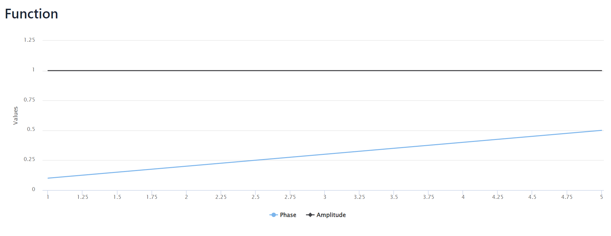

# opics_1

Project crated for learning purposes for optical informatics course
in the university made with
[Java 17](https://jdk.java.net/17/),
[Spring Boot](https://spring.io/projects/spring-boot),
and
[Vaadin](https://vaadin.com/).

### Task

Here the task was to examine Amplitude and Phase of a 
complex function _**f(x) = exp(ix/10)**_ and examine 
integral transformation of this function with the Complex core
_**K(ksi, x) = ix^(alpha*ksi-1)**_.

Here is phase and amplitude of given function:

And here is phase and amplitude of its integral transform:

